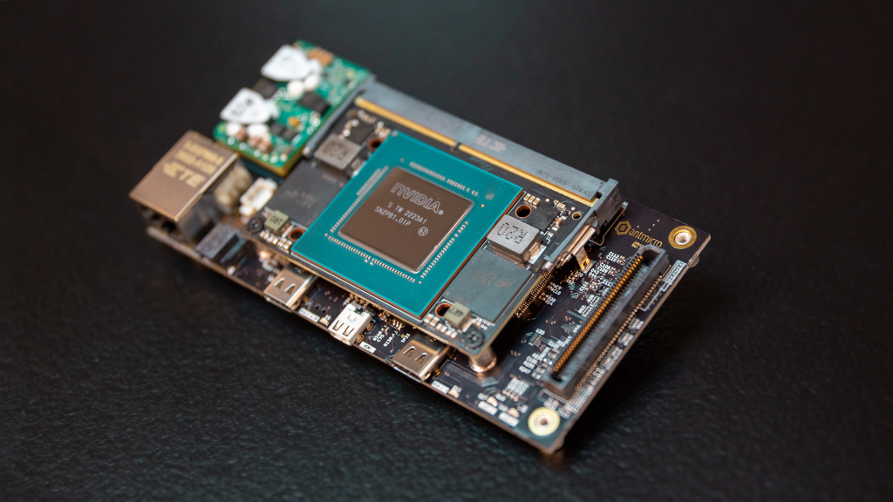
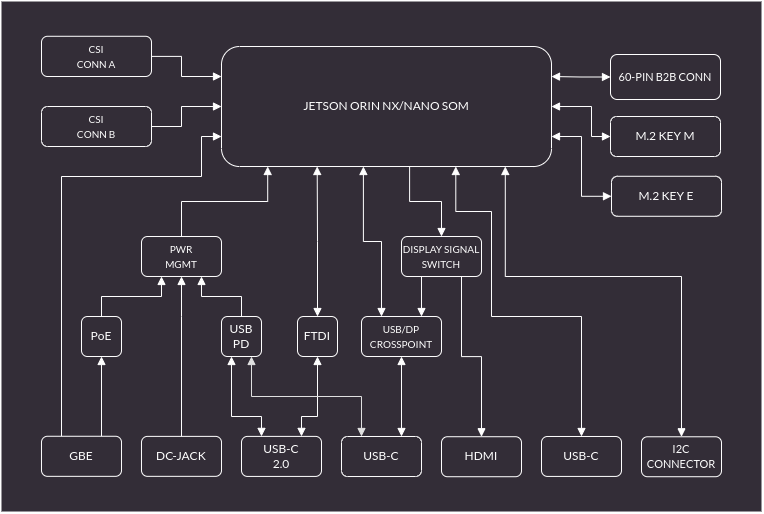

# Jetson Orin Baseboard

Copyright (c) 2022 [Antmicro](https://www.antmicro.com)

## Overview

This repository contains open hardware design files for a baseboard supporting NVIDIA Jetson Orin NX SoMs. 
The board break-routes the typical IO interfaces from the SoM.
Additionally, it exposes an expansion connector which allows it to be integrated with external processing modules using PCIe or low-speed interfaces.

The design files were preapared in KiCad 6.x.

## Key features

* Two USB PD ports
* DC Power connector
* MIPI CSI-2 interfaces on 50-pin connectors with configurable lane mapping
* Micro HDMI connector
* USB-C 10 Gbps with USB PD and DP
* USB-C 10 Gbps
* USB-C UART with USB PD
* M.2 key M
* M.2 key E
* 1Gb Ethernet with PoE
* Custom expansion connector
* RTC battery backup

## Repository structure

The main repository directory contains KiCad PCB project files, a LICENSE, and a README.
The remaining files are stored in the following directories:

* `lib` - contains the component libraries
* `img` - contains graphics for this README
* `doc` - contains schematics in pdf form

The board exposes MIPI CSI-2 interfaces using unified 50-pin connectors that are electrically compatible with a variety of video accessories created by Antmicro:

* [SDI-MIPI Video converter](https://github.com/antmicro/sdi-mipi-video-converter)
* [FRAMOS camera adapter](https://github.com/antmicro/framos-csi-adapter)
* [Allied Vision Alvium Camera Adapter](https://github.com/antmicro/alvium-flexible-csi-adapter)
* [HDMI-MIPI bridge](https://github.com/antmicro/hdmi-mipi-bridge)
* [OV9281 Dual camera board](https://github.com/antmicro/ov9281-camera-board)

## Board diagram

## Licensing

This project is published under the [Apache-2.0](LICENSE) license.

