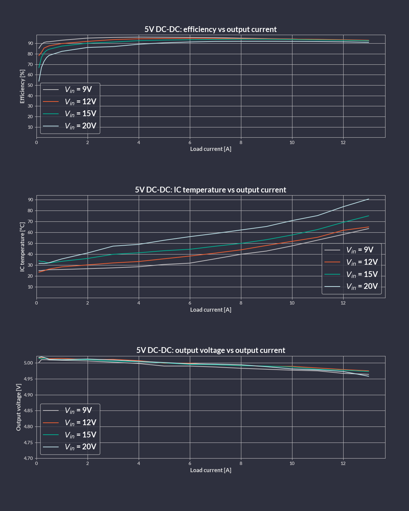
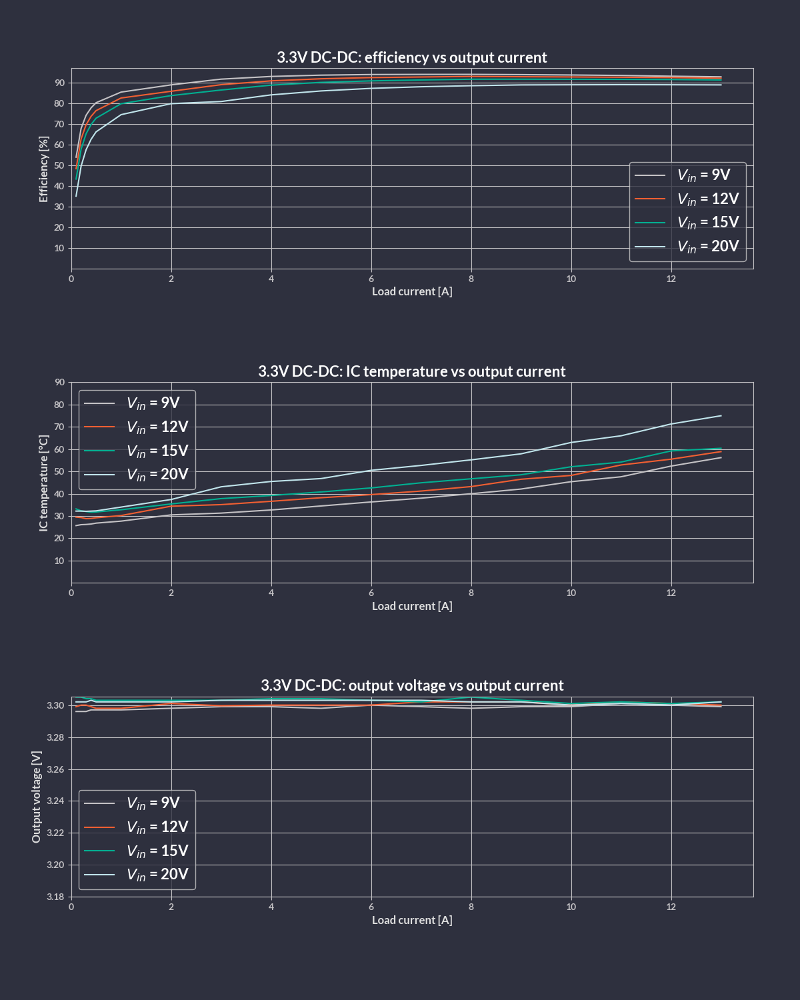

# Board overview

Jetson Orin Baseboard is an open hardware board design supporting NVIDIA Jetson Orin NX and Orin Nano family of SoMs.
The board design files were created in KiCad 8.x.
The board is a versatile development kit which can be easily adopted in order to make it usable in commercial applications for autonomous vehicles, industry, agriculture, medicine or space.
You can find out more about the Jetson Orin Baseboard in this [blog article](https://antmicro.com/blog/2023/05/jetson-orin-baseboard-1-1-with-orin-nano/), or by visiting Antmicro's portals listed below:

* [Open Hardware Portal](https://openhardware.antmicro.com/boards/jetson-orin-baseboard/)
* [System Designer](https://designer.antmicro.com/hardware/devices/jetson-orin-baseboard)
* [Open Source Portal](https://opensource.antmicro.com/projects/jetson-orin-baseboard/)

They provide 3D renders and the board stackup definition, as well as an interactive preview of the board schematic.
A [PDF schematic](https://github.com/antmicro/jetson-orin-baseboard/blob/main/doc/jetson-orin-baseboard-schematic.pdf) of the board is also available.

## IO map

A map of on-board connectors, status LEDs, control buttons and I/O interfaces is provided below.

:::{figure-md}


Jetson Orin Baseboard interface map
:::

## Power

The board can be powered with the following sources:

### 1. DC Connector

Jetson Orin Baseboard can be powered with a stable DC voltage via the on-board locking DC connector ([`J12`](#J12)) with Molex Nano-Fit plug (see the [Power Supply](getting_started.md#power-supply) section for details related to Nano-Fit power harness assembly).
You can use an external DC adapter for powering the board or a battery pack with rechargeable or non-rechargeable batteries, as long as the provided voltage fits within the accepted range (9-20VDC or up to 15 V on rev. <= 1.1.7).
Please note that Jetson Orin Baseboard does not support battery charging.

:::{note}
Since rev. >= 1.3.0, the SOM supply power path is automatically switched between `VCC_IN` and onboard `5V DC-DC` depending on the `MODULE_ID` pin status. For older releases, SOM is supplied from `5V DC-DC`.
:::

### 2. Power over Ethernet

Jetson Orin Baseboard supports PoE++ Type 1-4 (IEEE 802.3bt) and negotiates Power Delivery (PD) with a maximum power budget of 60W.
The board includes an isolated PoE DC/DC converter.
You can power the board via the Gigabit Ethernet port ([`J6`](#J6)) using a PoE injector or a PoE-capable Ethernet switch.

### 3. USB-C Power Delivery
* USB Power Delivery PD is available on two USB-C ports:
    * USB-C0 ([`J4`](#J4)) general purpose USB port
    * USB-C3 ([`J3`](#J3)) debug console interface port (disabled in the [shared](https://github.com/antmicro/antmicro-jetson-orin-baseboard-tps65988-config) controller configuration)

Those ports are maintained by the on-board USB-C Power Delivery controller (Texas Instruments/[TPS65988](https://www.ti.com/product/TPS65988/part-details/TPS65988DHRSHR)).
This controller needs to be configured in order to make it implement one of the desired power source/sink negotiation scenarios.

:::{note}
The recommended power supply voltage negotiated with the USB-C PD controller for power sink mode is 15VDC or 20VDC for rev. >= 1.1.8.
If you plan to power up the Jetson Orin Baseboard through the USB PD source, make sure it meets [power requirements](getting_started.md#2-power-supply) for stable operation.
:::


## USB-C Power Delivery controller configuration

The on-board USB-C Power Delivery controller (Texas Instruments/[TPS65988](https://www.ti.com/product/TPS65988/part-details/TPS65988DHRSHR)) can be configured for a specific power profile by writing a binary configuration file to an SPI flash.
You can generate your own configuration file with the [TPS6598X-CONFIG](https://www.ti.com/tool/TPS6598X-CONFIG) utility provided by Texas Instruments.
Please refer to the Jetson Orin Baseboard [schematics](https://github.com/antmicro/jetson-orin-baseboard/blob/main/doc/jetson-orin-baseboard-schematic.pdf) to identify the USB port and power supply rail associated with it to generate a valid power profile setting while using the `TPS6598X-CONFIG` tool.
Also please refer to the [TPS65987DDH and TPS65988DH Host Interface Technical Reference Manual](https://www.ti.com/lit/ug/slvubh2b/slvubh2b.pdf) for further details.

There are three ways to upload the configuration:
* Via an external SPI Flash programmer connected to the [`J9`](#J9)
* Via the [TPS65988-config tool](https://github.com/antmicro/antmicro-jetson-orin-baseboard-tps65988-config)
  * From Jetson Orin (user space)
  * From the USB-C ([`J3`](#J3)) debug console interface port (only for rev. >= 1.1.9)

The recommended and least demanding method is [flashing from the debug console interface port](#tps65988-config-tool-via-the-debug-console-interface-port).

### External SPI Flash programmer
#### 1. Collect the hardware

You will need the following pieces of hardware to proceed with writing the USB-C PD configuration file to the SPI Flash:

* A computer running Linux (the following procedure has been tested with Ubuntu 23 and Debian 11 distributions)
* USB dongle based on FTDI/(FT4232H-56Q) [FTDI4232](https://ftdichip.com/products/ft4232hq/).
  We suggest using Antmicro's open hardware [Debug Toolkit](https://github.com/antmicro/ftdi-toolkit) to simplify the setup (the cable mentioned below connects its J2 straight with Jetson Orin Baseboard's J9)
* 10 Pin Tag-Connect [TC2050-IDC-NL](https://www.tag-connect.com/product/tc2050-idc-nl-10-pin-no-legs-cable-with-ribbon-connector) cable
  This cable should be connected to the signals from FTDI FT4232 according to the following table:

| Tag-Connect TC2050-IDC-NL-050 [(pinout)](https://www.tag-connect.com/wp-content/uploads/bsk-pdf-manager/TC2050-IDC-NL_Datasheet_8.pdf) | FTDI 4232 [(pinout)](https://ftdichip.com/wp-content/uploads/2024/05/DS_FT4232H.pdf) |
|----------------------------------------------------------------------------------------------------------------------------------------|--------------------------------------------------------------------------------------|
| 1                                                                                                                                      | 3V3                                                                                   |
| 2                                                                                                                                      | ADBUS3 (TMS/CS)                                                                       |
| 3                                                                                                                                      | GND                                                                                   |
| 4                                                                                                                                      | ADBUS0 (TCK/SCLK)                                                                     |
| 5                                                                                                                                      | GND                                                                                   |
| 6                                                                                                                                      | ADBUS2(TDO/MISO)                                                                      |
| 7                                                                                                                                      | NC                                                                                    |
| 8                                                                                                                                      | ADBUS1 (TDI/MOSI)                                                                     |
| 9                                                                                                                                      | GND                                                                                   |
| 10                                                                                                                                     | NC                                                                                    |

#### 2. Prepare the FT4232 dongle

  *  Set the [Debug Toolkit](https://github.com/antmicro/ftdi-toolkit) Channel A to 3.3V logic with a jumper.
  *  Enable JTAG VCC with a jumper.
  *  Select `SPI/SWD` interface mode for channel A with a jumper.
  *  Connect the 10 Pin Tag-Connect cable to the Debug Toolkit assuming the connection mapping specified in the table above (for Antmicro Debug Toolkit - connect to J2 connector).

:::{figure-md}


Debug Toolkit Jumper configuration for writing the USB-C PD configuration file.
:::

#### 3. Prepare the PC for flashing

  * Install the [flashrom](https://github.com/flashrom/flashrom) utility on your host PC.
    On Debian-based distributions you can use a package manager for that.
```
sudo apt install flashrom
```
  * Adjust the size of the TPS6598 binary configuration file (we named it `config.bin`) to match the SPI flash size:
```
truncate -s 1048576 config.bin
```

#### 4. Write the configuration

  * Connect [Tag-Connect Plug-of-Nails](https://www.tag-connect.com/product/tc2050-idc-nl-050) to the [`J9`](#J9) connector on the Jetson Orin Baseboard.
   Hold the plug in place firmly during the flashing process.
   The SPI flash will be powered via the programming cable during the flashing process - you do not have to provide your Jetson Orin Baseboard with power.

:::{figure-md}


Jetson Orin Baseboard with Tag-Connect plugged for PD controller flashing.
:::

 * Check if SPI Flash can be detected via Debug Toolkit:
```
flashrom -p ft2232_spi:type=4232H,port=A,divisor=64 | grep "W25Q80.V"
```
Expected outcome:
```
Found Winbond flash chip "W25Q80.V" (1024 kB, SPI) on ft2232_spi.
```

 * Write the configuration file to the SPI Flash:
```
flashrom -p ft2232_spi:type=4232H,port=A,divisor=64 -w config.bin
```
Expected outcome:
```
(...)
Reading old flash chip contents... done.
Erasing and writing flash chip... Erase/write done.
Verifying flash... VERIFIED.
```

 *  You can repeat the previous command to ensure that the binary file has been written successfully:

Expected outcome:
```
(...)
Warning: Chip content is identical to the requested image.
Erase/write done.
```

### TPS65988-config tool from Jetson Orin user space

The TPS65988-config flashing script can be found in this [repository](https://github.com/antmicro/antmicro-jetson-orin-baseboard-tps65988-config).

#### 1. Prepare hardware

To properly execute this script, boot the Jetson, and connect to it via [debug console](#connect-the-debug-console) or via SSH. Since the PD controller is not yet configured at this point, the baseboard has to be powered from either the [`J12`](#J12) or via PoE connected to the [`J6`](#J6).\
Internet connection is also suggested.

#### 2. Install dependencies
Log into Jetson Orin

Clone this [repository](https://github.com/antmicro/antmicro-jetson-orin-baseboard-tps65988-config) and install `smbus2` package with `pip`

```
git clone https://github.com/antmicro/antmicro-jetson-orin-baseboard-tps65988-config.git
pip3 install smbus2
cd antmicro-jetson-orin-baseboard-tps65988-config
```

#### 3. Flash the config
Run:

```
python3 TPS65988_flash.py --erase --write JOBrev1_1_6.bin
```

Expected outcome:
```
(...)
Writing 42KB to flash memory...
Write completed 43968 bytes written
The PD Controller has been flashed successfully
Performing cold reset
```
### TPS65988-config tool via the debug console interface port
This option allows for flashing the USB-C Power Delivery controller without SoM or external power.

#### 1. Prepare hardware
* Disconnect power supply from the baseboard
* Remove Jetson module from the baseboard
* Connect a host PC to Jetson Orin Baseboard USB-C Debug Connector ([`J3`](#J3))

#### 2. Install dependencies

On the host PC:

Clone this [repository](https://github.com/antmicro/antmicro-jetson-orin-baseboard-tps65988-config) and install `smbus2` package with `pip`

```
git clone https://github.com/antmicro/antmicro-jetson-orin-baseboard-tps65988-config.git
pip3 install smbus2
cd antmicro-jetson-orin-baseboard-tps65988-config
```

#### 3. Flash the config
```
python3 TPS65988_flash.py --erase --write ./JOBrev1_1_6.bin --ft230x
```
During the flashing process the [`D3`](#D3) LED should light up.

Expected outcome:
```
(...)
Writing 42KB to flash memory...
Write completed 43968 bytes written
The PD Controller has been flashed successfully
Performing cold reset
Reverting FT230X to UART configuration
```
The [`D3`](#D3) RX LED should turn off indicating end of communication.

## Mechanics

The Jetson Orin Baseboard PCB is 120x60 millimeters (WxL) which translates into 4.72x2.36 inch.
The overall height of the set depends on the cooling module attached.
The base setup with a default cooling module is 37 mm or 1.45 inch tall.
The KiCad PCB design files include mechanical layers with dimensions specified for the fastening holes and notable components.
The board with the Jetson Module, M.2 storage and cooling module weighs 164g (5.78oz).
The mechanical STEP model of the Jetson Orin Baseboard is provided in the [1.1.6 design release](https://github.com/antmicro/jetson-orin-baseboard/releases/tag/rev.1.1.6-ch) available on GitHub.


## DC-DC converters stress test

Revision `1.1.8` introduced changes to the DC-DC converters that allowed the board to be powered from up to 20V. Below you can find the results from stress test of the two main converters: `Vcc to 5V` and `Vcc to 3V3`. Both of these converters were implemented using the same controller: `SIC431AED-T1-GE3`.

Test were performed under following conditions:
* Input voltage: 9V, 12V, 15V, 20V
* Load current: 0A - 13A (Electronic load: `RND 320-KEL103`)
* Ambient temperature: 24°C
* Incremental steps of 0.1A between 0.1A - 0.5A, and 1A step between 1A - 13A
* Input voltage and output load leads were soldered directly to input/output capacitors

:::{figure-md}


Efficiency, temperature and output voltage versus output current of the `5V` converter
:::

:::{figure-md}


Efficiency, temperature and output voltage  versus output current of the `3V3` converter
:::


