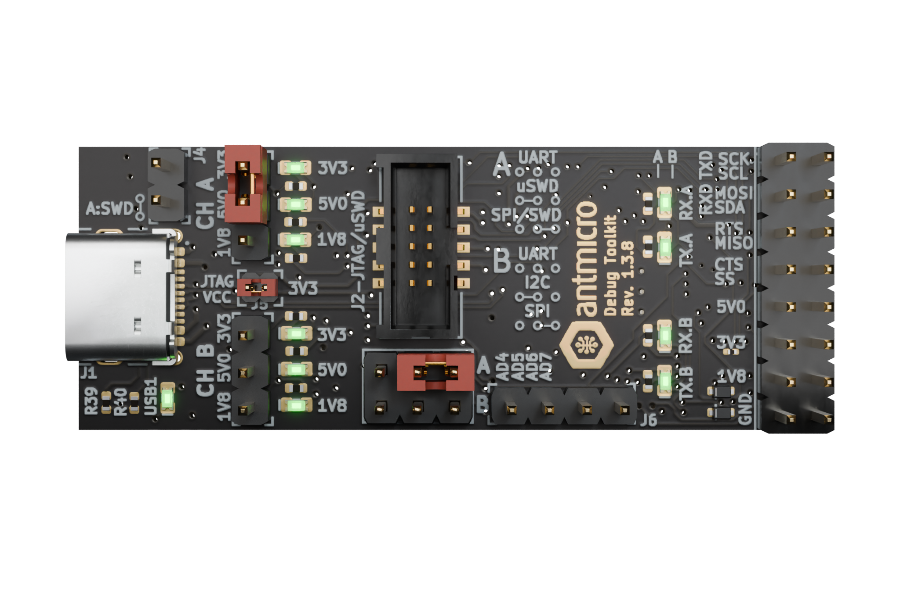

# Board overview

Jetson Orin Baseboard is an open hardware board design supporting NVIDIA Jetson Orin NX and Orin Nano family of SoMs.
The board design files were created in KiCad 7x.
The board is a versatile development kit which can be easily adopted in order to make it usable in commercial applications for autonomous vehicles, industry, agriculture, medicine or space.
You can find out more about the Jetson Orin Baseboard in this [blog article](https://antmicro.com/blog/2023/05/jetson-orin-baseboard-1-1-with-orin-nano/), or by visiting Antmicro's portals listed below:

* [Open Hardware Portal](https://openhardware.antmicro.com/boards/jetson-orin-baseboard/)
* [System Designer](https://designer.antmicro.com/hardware/devices/jetson-orin-baseboard)
* [Open Source Portal](https://opensource.antmicro.com/projects/jetson-orin-baseboard/)
 
They provide 3D renders and the board [stackup definition](https://openhardware.antmicro.com/boards/jetson-orin-baseboard/?view=top-ortho&tab=stackup), as well as [an interactive preview](https://openhardware.antmicro.com/boards/jetson-orin-baseboard/?view=top-ortho&tab=preview) of the board schematic.
A [PDF schematic](./jetson-orin-baseboard-schematic.pdf) of the board is also available.

## IO map 

A map of on-board connectors, status LEDs, control buttons and I/O interfaces is provided below.

:::{figure-md}


Jetson Orin Baseboard interface map
:::

## Power

The board can be powered with the following sources:

### 1. DC Connector
 
Jetson Orin Baseboard can be powered with a stable DC voltage via the on-board locking DC connector ([`J12`](#J12)) with Molex Nano-Fit plug (see the [Power Supply](getting_started.md#power-supply) section for details related to Nano-Fit power harness assembly).
You can use an external DC adapter for powering the board or a battery pack with chargeable or non-rechargeable batteries, as long as the provided voltage fits within the accepted range (9-15VDC).
Please note that Jetson Orin Baseboard does not support battery recharging.

### 2. Power over Ethernet

Jetson Orin Baseboard supports PoE++ Type 3 (IEEE 802.3bt) and negotiates Power Delivery (PD) Class 5 with a maximum power budget of 40W.
The board includes an isolated PoE DC/DC converter.
You can power the board via the Gigabit Ethernet port ([`J6`](#J6)) using a PoE injector or a PoE-capable Ethernet switch.

### 3. USB-C Power Delivery
    
* USB Power Delivery PD, available on two USB-C ports:
    * USB-C0 ([`J4`](#J4)) general purpose USB port 
    * USB-C3 ([`J3`](#J3)) debug console interface port

Those ports are maintained by the on-board USB-C Power Delivery controller (Texas Instruments/[TPS65988](https://www.ti.com/product/TPS65988/part-details/TPS65988DHRSHR)).
This controller needs to be configured in order to make it implement one of the desired power source/sink negotiation scenarios.

:::{note}
The recommended power supply voltage negotiated with USB-C PD controller for power sink mode is 15VDC.
If you plan to power up the Jetson Orin Baseboard through the USB PD source, make sure it provides at least 45W of power for stable operation.
:::

## Configuring the USB-C Power Delivery controller

The on-board USB-C Power Delivery controller (Texas Instruments/[TPS65988](https://www.ti.com/product/TPS65988/part-details/TPS65988DHRSHR)) can be configured for a specific power profile by writing a binary configuration file to an SPI flash.
You can generate your own configuration file with the [TPS6598X-CONFIG](https://www.ti.com/tool/TPS6598X-CONFIG) utility provided by Texas Instruments.
Please refer to the Jetson Orin Baseboard [schematics](./jetson-orin-baseboard-schematic.pdf) to identify the USB port and power supply rail associated with it to generate a valid power profile setting while using the `TPS6598X-CONFIG` tool.
Also please refer to the [TPS65987DDH and TPS65988DH Host Interface Technical Reference Manual](https://www.ti.com/lit/ug/slvubh2b/slvubh2b.pdf) for further details.

In order to make the USB-C Power Delivery configuration permanent, upload the configuration file generated with `TPS6598X-CONFIG` to the configuration SPI Flash [`U7`](#U7) via an external SPI Flash programmer connected to the ``J9`` configuration port located on the bottom side of the Jetson Orin Baseboard.

### 1. Collect the hardware

You will need the following pieces of hardware to proceed with writing the USB-C PD configuration file to a SPI Flash:

* USB dongle based on FTDI/(FT4232H-56Q)[FTDI4232](https://ftdichip.com/products/ft4232hq/).
  We suggest using Antmicro's open hardware [Debug Toolkit](https://github.com/antmicro/ftdi-toolkit)
* A computer running Linux - the following procedure was tested with Ubuntu 23 and Debian 11 distributions
* 10 Pin Tag-Connect [TC2050-IDC-NL](https://www.tag-connect.com/product/tc2050-idc-nl-10-pin-no-legs-cable-with-ribbon-connector) cable
  This cable should be connected to the signals from FTDI FT4232 with respect to the following mapping:

| Tag-Connect TC2050-IDC-NL-050 [(pinout)](https://www.tag-connect.com/wp-content/uploads/bsk-pdf-manager/TC2050-IDC-NL_Datasheet_8.pdf) | FTDI 4232 [(pinout)](https://ftdichip.com/wp-content/uploads/2024/05/DS_FT4232H.pdf) |
|----------------------------------------------------------------------------------------------------------------------------------------|--------------------------------------------------------------------------------------|
| 1                                                                                                                                      | 3V3                                                                                  |
| 2                                                                                                                                      | GND                                                                                  |
| 3                                                                                                                                      | NC                                                                                   |
| 4                                                                                                                                      | NC                                                                                   |
| 5                                                                                                                                      | NC                                                                                   |
| 6                                                                                                                                      | NC                                                                                   |
| 7                                                                                                                                      | ADBUS1 (TDI/MOSI)                                                                    |
| 8                                                                                                                                      | ADBUS2(TDO/MISO)                                                                     |
| 9                                                                                                                                      | ADBUS0 (TCK/SCLK)                                                                    |
| 10                                                                                                                                     | ADBUS3 (TMS/CS)                                                                      |

### 2. Prepare the FT4232 dongle

  *  Set the [Debug Toolkit](https://github.com/antmicro/ftdi-toolkit) Channel A to 3.3V logic with a jumper.
  *  Enable JTAG VCC with a jumper.
  *  Select `SPI/SWD` interface mode for channel A with a jumper.
  *  Connect a 10 Pin Tag-Connect cable with the Deubg Toolkit assuming the connection mapping specified in the table above.

:::{figure-md}


Debug Toolkit Jumper configuration for writing the USB-C PD configuration file.
:::

### 3. Prepare the PC for flashing

  * Install the [flashrom](https://github.com/flashrom/flashrom) utility on your host PC.
    On Debian-based distributions you can use a package manager for that.
```
sudo apt install flashrom
```
  * Adjust the size of the TPS6598 binary configuration file (we named it `config.bin`) to match the SPI flash size:
```
truncate -s 1048576 config.bin
```

### 4. Write the configuration

  * Connect [Tag-Connect Plug-of-Nails](https://www.tag-connect.com/product/tc2050-idc-nl-050) to the ``J9`` connector on board. 
   Hold plug in place firmly during flashing process.
   The SPI flash will be powered via the programming cable during the flashing process - you do not have to provide your Jetson Orin Baseboard with power.

:::{figure-md}


Jetson Orin Baseboard with Tag-Connect plugged for PD controller flashing.
:::

 * Check if SPI Flash can be detected via Debug Toolkit:
```
flashrom -p ft2232_spi:type=4232H,port=A,divisor=64 | grep "W25Q80.V"
```
Expected outcome:
```
Found Winbond flash chip "W25Q80.V" (1024 kB, SPI) on ft2232_spi.
```

 * Write the configuration file to an SPI Flash:
```
flashrom -p ft2232_spi:type=4232H,port=A,divisor=64 -w config.bin
```
Expected outcome:
```
(...)
Reading old flash chip contents... done.
Erasing and writing flash chip... Erase/write done.
Verifying flash... VERIFIED.
```

 *  You can repeat the previous set to ensure that binary file has been written successfully:

Expected outcome:
```
(...)
Warning: Chip content is identical to the requested image.
Erase/write done.
```

## Mechanics

The Jetson Orin Baseboard PCB is 120x60 millimeters (WxL) which translates into 4.72x2.36 inch.
The overall height of the set depends on the cooling module attached.
The base setup with a default cooling module is 37 mm or 1.45 inch tall. 
The KiCad PCB design files include mechanical layers with dimensions specified for the fastening holes and notable components. 
The board with the Jetson Module, M.2 storage and cooling module weighs 164g (5.78oz). 
The mechanical STEP model of the Jetson Orin Baseboard is provided in the [1.1.6 design release](https://github.com/antmicro/jetson-orin-baseboard/releases/tag/rev.1.1.6-ch) available on GitHub.

