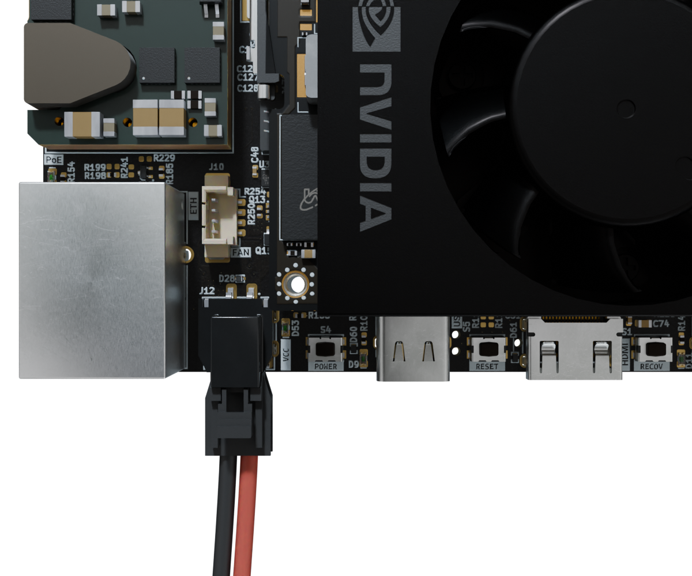
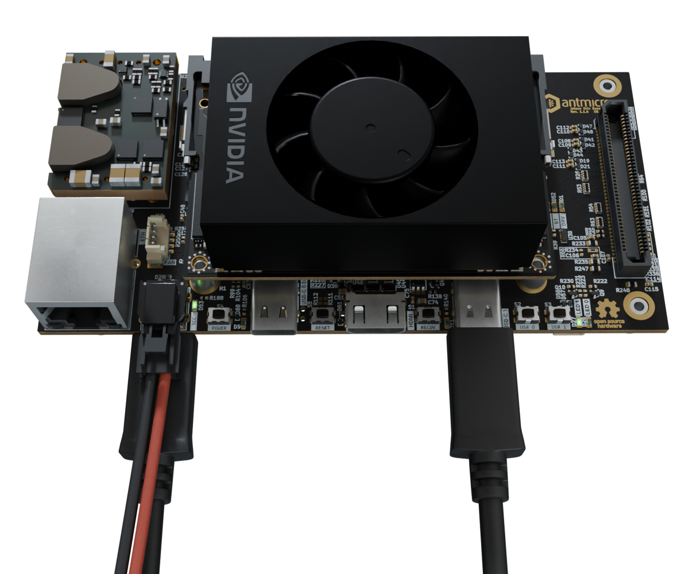

# Getting started guide

This manual will guide you through the initial setup of the open hardware [Jetson Orin Baseboard](https://github.com/antmicro/jetson-orin-baseboard).
It describes the basic steps required to assemble the board with required peripheral accessories, write a compiled Board Support Package (BSP) to the processing module and get it booted.
If you want to learn more about the Jetson Orin Baseboard itself, go to the [Board Overview](./board_overview.md) section.
That section also includes an [I/O map](./board_overview.md#io-map) that may come in handy when locating interface connectors mentioned in this guide.

## Collect the hardware

To get started with the Jetson Orin Baseboard, you'll need the following hardware:

### 1. Jetson SoM

The Jetson Orin Baseboard is electrically compatible with the NVIDIA Jetson Orin NX and Jetson Orin Nano [family of SoMs](https://developer.nvidia.com/embedded/jetson-modules).
The provided reference BSP has been developed for NVIDIA Jetson Orin NX 16GB (900-13767-0000-000) but it should work with other modules as well.

### 2. Power supply

The Jetson Orin Baseboard can be powered with a benchtop PSU or AC/DC wall adapter providing DC voltage in the 9-15 VDC range with at least 30W.
For starters, it is recommended to power the board via a DC locking connector (`J12`) which accepts a 2-wire Molex Nano-Fit plug.
You can use an off-the-shelf Nano-Fit Cable assembly (Molex/[451300203](https://www.molex.com/en-us/products/part-detail/451300203)) or build a custom one from a Nano-Fit receptacle (Molex/[1053071202](https://www.molex.com/en-us/products/part-detail/1053071202)) and pre-crimped wires (Molex/[797582130](https://www.molex.com/en-us/products/part-detail/797582130)). 
You can also power the board via an RJ45 (`J6`) Ethernet connector using a PoE injector or a PoE-capable Ethernet switch compliant with the IEEE 802.3bt standard and offering at least 40W of power budget.

### 3. Storage

You should equip the Jetson Orin Baseboard with M.2 NVMe SSD storage with at least 64GB of capacity.
That will be the primary storage device from which the SoM will boot.

### 4. Cooling module

You can use the Jetson Orin compatible cooling fan (Waveshare/[24076](https://www.waveshare.com/orin-fan-pwm.htm)) as a primary cooling solution when working with the Jetson Orin Baseboard.
Using a SoM without any cooling solution attached will make it throttle and eventually reboot or crash the system due to overheating.

### 5. Fastening bolts

You will need at least one metric M2.5 (5mm long) bolt and a matching screwdriver to fasten the SSD to the baseboard.
You may want to use more bolts to fasten the SoM and the baseboard to the baseplate.
All mechanical fastening points located on the board support bolts with metric M2.5 thread (ISO 7045).

### 6. Host PC

You will need a computer running Linux for flashing the reference BSP image to the Jetson Orin SoM installed in the baseboard. 
The BSP flashing instructions provided below were verified with Debian and Arch based systems.
You may need to introduce minor adjustments for other Linux distros.

### 7. Cabling

You will need two USB-C cables for connecting the SoM flashing port and the debug port located on the Jetson Orin Baseboard to your PC.
You should avoid using USB hubs for the flashing interface to get the optimal flashing speed/performance.

## Build your setup

To prepare the Jetson Orin Baseboard for initial usage, follow the steps described below: 

### 1. Install the cooling module

Begin with installing the cooling fan on the Jetson Orin SoM.
Make sure the openings carved in the bottom side of the heatsink match the power inductors located on the Jetson Orin SoM. 
Please refer to the Jetson Cooling Fan [product page](https://www.waveshare.com/orin-fan-pwm.htm) for details.

### 2. Install the SoM

Securely attach the NVIDIA Jetson Orin SoM to the `J15` connector of the Jetson Orin Baseboard.
Remember to connect the cooling fan plug into the `J10` fan receptacle. 
Optionally, you can fasten the SoM to the baseboard with two metric M2.5 (5mm long) bolts.

### 3. Install the storage 

Install the NVMe M.2 SSD storage in the `J2` M.2 (key-M) slot located on the bottom side (i.e opposite side to the SoM) of the Jetson Orin Baseboard.
You need to fasten the SSD with one metric M2.5 (5mm long) bolt to ensure reliable connection.

### 4. Apply power supply

Prepare a power cable assembly terminated with a Molex Nano Fit plug that fits the `J12` DC connector located on the Jetson Orin Baseboard.
Please verify the polarity and voltage you use for powering the board.
Apply power to the board.
That should cause the VCC (`D53`) power indicator LED to light up.

:::{figure-md}


Jetson Orin Baseboard DC power connection with polarity marking (red: vcc, black: gnd).
:::

Alternatively you can use a PoE injector or PoE-capable Ethernet switch and power-up the board via Ethernet connector (`J6`).
This should cause the PoE indicator LED (``D15``) and VCC (`D53`) power indicator LED to light up. 

### 5. Connect the debug console

Connect the debug USB-C (`J3`) port (located on the bottom side, under the power connector) to your PC. 
This should get a virtual USB/serial port registered in your system under ``/dev/ttyUSBx``.
You can check the ``lsusb`` or ``dmesg`` commands to verify if the serial bridge was enumerated properly.

### 6. Connect the flashing interface

Connect the flashing USB-C (`J5` which is the right-most port on the top side of the Jetson Orin Baseboard) to your PC.
This should cause the `D11` LED indicator located next to the USB port to light up.
Now you are ready to prepare the BSP flashing image and initialize the flashing process.

:::{figure-md}


Jetson Orin Baseboard with USB and power connections required for flashing.
:::

## Flash the BSP image

Jetson Orin Baseboard comes with a reference BSP image of a Yocto-based system built on top of the [meta-antmicro](https://github.com/antmicro/meta-antmicro) layer.
This BSP will let you verify the basic functionality of the board.
The following steps will guide you through the process of downloading and flashing a precompiled Board Support Package (BSP) for the Jetson Orin Baseboard.

### 1. Get the BSP image

First, create a workspace directory that will contain all of the files you will need for flashing:

```bash
export WORK="$HOME/antmicro-job-bsp"
mkdir -p $WORK
```
Download the BSP image into the previously created workspace directory.
The image archive is around 283MB in size.

```bash
cd $WORK
wget https://dl.antmicro.com/projects/nvidia-jetson-orin-baseboard-demo-p3509-a02-p3767-0000-20240723125144.tegraflash.tar.gz
```
Next, unpack the BSP image:

```bash
mkdir -p $WORK/bsp
cd $WORK/bsp
tar xvzf $WORK/nvidia-jetson-orin-baseboard-demo-p3509-a02-p3767-0000-20240723125144.tegraflash.tar.gz
```

### 2. Install dependencies

You need to have a `device-tree-compiler` installed on your machine for the flash tool to work.
On a Debian-like system, you can install it via apt:

```bash
sudo apt-get install device-tree-compiler
```

On an Arch-like system, you can install it via pacman:

```bash
sudo pacman -S dtc
```

### 3. Disable auto-mounting

When running a Debian-like operating system, you might encounter some difficulties with flashing the board, due to problems with disk auto-mounting.
A simple workaround for this issue is to disable auto-mounting for the time being:

```bash
gsettings set org.gnome.desktop.media-handling automount false
gsettings set org.gnome.desktop.media-handling automount-open false
```

### 4. Enter recovery mode

Make sure that the Jetson Orin Baseboard is [connected to a power source](#apply-power-supply) and that you have connected the [debug console USB](#connect-the-debug-console) and the [flashing USB interface](#connect-the-flashing-interface) to your PC, as described in the [Build your setup](#build-your-setup) section. 
As already mentioned in the [Cabling](#cabling) section, you should be entering the recovery mode with direct connection of the flashing USB interface to the PC (i.e. there should be no USB hubs in between).
In order to enter the recovery mode, execute the following procedure using buttons located on the top side of the Jetson Orin Baseboard, oriented as shown in the photo above.

* Press and release the `POWER` button located on the top side, next to the DC power jack.
  The cooling fan on top of the Jetson SoM should start spinning slowly.
* Press and hold the `RECOV` (FORCE_RECOVERY) button located on the top side between the HDMI port and the right-most USB-C connector.
* Press and release the `RESET` button located on the top side between the HDMI port and the left-most USB-C connector.
* Release the `RECOV` button.
  The SoM cooling fan will now start spinning faster.

On the host PC, you should now see the following new USB device being detected (e.g. via lsusb):
```bash
lsusb | grep -i nvidia
# Bus 001 Device 026: ID 0955:7523 NVIDIA Corp. APX
```

The Jetson SoM will stay in the recovery mode for ~45s and then it will make an attempt to boot up. 
If needed, repeat the procedure to force the SoM back into recovery mode.

### 5. Open debug console

Whenever developing with the Jetson Orin Baseboard, it always makes sense to have a terminal hooked to the Debug UART on your host PC.
You can use any serial port terminal emulator for that, but we’ll use ``picocom`` in this guide.
Make sure that the [debug console USB](#connect-the-debug-console) is connected to your host PC and the USB-serial converter is enumerated:
```bash
lsusb -d 0403:
# Bus 001 Device 118: ID 0403:6015 Future Technology Devices International, Ltd Bridge(I2C/SPI/UART/FIFO)
sudo dmesg | grep FTDI
# [1740634.745814] usb 1-4: FTDI USB Serial Device converter now attached to ttyUSB0
```

Run the terminal:
```bash
sudo picocom -b 115200 /dev/ttyUSB0
```

You should keep the ``picocom`` terminal open in a separate window/tab throughout board flashing.
That will give you an insight into the progress and debug log messages displayed during the process.

### 6. Flash the board

Open another terminal instance on your PC and navigate to the directory which holds the downloaded and unpacked BSP, as described in the [Get the BSP image](#get-the-bsp-image) section.

```bash
cd $HOME/antmicro-job-bsp/bsp
```

Make sure your SoM remains in the recovery mode. 
Then, execute the flashing script from the same directory:

```bash
sudo ./initrd-flash
```
Be patient, as flashing might take a while (up to 30min). 
When the flashing succeeds, you should see a log similar to the one below:

```bash
Starting at 2024-07-05T11:43:56+00:00
Machine:       p3509-a02-p3767-0000
Rootfs device: nvme0n1p1
Found Jetson device in recovery mode at USB 1-8
== Step 1: Signing binaries at 2024-07-05T11:43:56+00:00 ==
== Step 2: Boot Jetson via RCM at 2024-07-05T11:44:09+00:00 ==
Found Jetson device in recovery mode at USB 1-8
== Step 3: Sending flash sequence commands at 2024-07-05T11:44:12+00:00 ==
Waiting for USB storage device flashpkg from e3340a08...........[/dev/sdc]
Device size in blocks: 262144
== Step 4: Writing partitions on external storage device at 2024-07-05T11:44:57+00:00 ==
Waiting for USB storage device nvme0n1 from e3340a08...[/dev/sdc]
Creating partitions
  [02] name=kernel start=0 size=131072 sectors
  [03] name=kernel-dtb start=0 size=896 sectors
  [04] name=reserved_for_chain_A_user start=0 size=65536 sectors
  [05] name=kernel_b start=0 size=131072 sectors
  [06] name=kernel-dtb_b start=0 size=896 sectors
  [07] name=reserved_for_chain_B_user start=0 size=65536 sectors
  [08] name=recovery start=0 size=163840 sectors
  [09] name=recovery-dtb start=0 size=1024 sectors
  [10] name=RECROOTFS start=0 size=614400 sectors
  [11] name=esp start=0 size=131072 sectors
  [12] name=recovery_alt start=0 size=163840 sectors
  [13] name=recovery-dtb_alt start=0 size=1024 sectors
  [14] name=esp_alt start=0 size=131072 sectors
  [01] name=APP (fills to end)
Writing partitions
  Writing boot.img (size=37214208) to /dev/sdc2 (size=67108864)...
  Writing kernel_tegra234-p3767-0000-antmicro-job.dtb (size=333342) to /dev/sdc3 (size=458752)...
  Writing boot.img (size=37214208) to /dev/sdc5 (size=67108864)...
  Writing kernel_tegra234-p3767-0000-antmicro-job.dtb (size=333342) to /dev/sdc6 (size=458752)...
  Writing esp.img (size=67108864) to /dev/sdc11 (size=67108864)...
  Writing nvidia-jetson-orin-baseboard-demo.ext4 (size=59055800320) to /dev/sdc1 (size=255237365248)...
[OK: /dev/sdc]
== Step 5: Waiting for final status from device at 2024-07-05T12:13:37+00:00 ==
Waiting for USB storage device flashpkg from e3340a08...[/dev/sdc]
Final status: SUCCESS
Successfully finished at 2024-07-05T12:13:41+00:00
Host-side log:              log.initrd-flash.2024-07-05-11.43.56
Device-side logs stored in: device-logs-2024-07-05-11.43.56
```

Common Issue:
When a device is connected through a USB hub, the initrd-flash script may not recognize it, and it can get stuck displaying "Waiting for Jetson to appear on USB.......". 
To verify whether the baseboard is directly connected to a root hub, use the `lsusb -vt` command.
Note that some USB ports on your PC motherboard USB may also be internally connected through a hub.

### 7. Login

After successful flashing, the SoM should reboot and you should see the booting log in the [debug console](#open-debug-console).
The SoM should boot up to the login screen visible in the debug console.
The reference BSP comes with a preconfigured root account.
To log in to the console, connect to the board via UART, turn on the power, and wait for the board to boot.
When it successfully boots, you will be asked for login and password:

```
p3509-a02-p3767-0000 login:
```

Use the following login credentials to get access to the system:

```
login: root
password: root
```