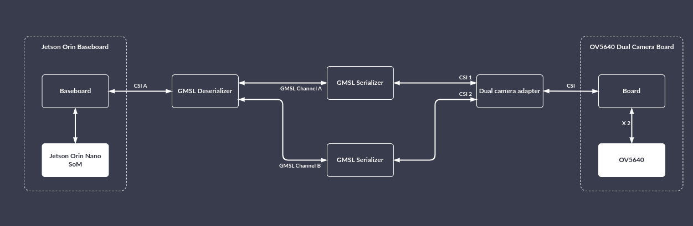

# GMSL
This manual will guide you through the setup of the open hardware GMSL Deserializer and Serializer boards together with Jetson Orin Baseboard.
It describes the basic steps required to run a simple demo that captures feed from the connected OV5640 sensor.

## Collect the hardware
You'll need the following hardware:
* [NVIDIA Jetson Orin Nano SoM](https://www.nvidia.com/en-us/autonomous-machines/embedded-systems/jetson-orin/)
* [Antmicro Jetson Orin Baseboard](https://github.com/antmicro/jetson-nano-baseboard)
* [Antmicro OV5640 dual camera board](https://github.com/antmicro/ov5640-dual-camera-board)
* [Antmicro GMSL Serializer](https://github.com/antmicro/gmsl-serializer) x 2
* [Antmicro GMSL Deserializer](https://github.com/antmicro/gmsl-deserializer)
* [Antmicro Dual Camera to GMSL Serializer CSI Adapter](https://github.com/antmicro/dual-gmsl-serializer-adapter) (optional, for two camera setup)
* NVMe drive
* Power supplies (for GMSL Deserializer it can be the same as for the Jetson Orin Baseboard)

## Build your setup

### Prerequisites
First follow the steps in [Getting Started](./getting_started.md) to have a running Jetson Orin Baseboard ready.

### Steps


To prepare the Jetson Orin Baseboard for GMSL usage, connect the hardware like in the diagram above, that is:
1. Connect GMSL Deserializer to Jetson Orin Baseboard on CSI A
2. Connect GMSL Serializer #1 to GMSL Deserializer on Channel A
3. Connect GMSL Serializer #2 to GMSL Deserializer on Channel B
4. Connect GMSL Serializer #1 to the dual camera adapter
5. Connect GMSL Serializer #2 to the dual camera adapter
6. Connect OV5640 Dual Camera Board to the dual camera adapter
7. Plug in the power supply to the GMSL Deserializer
8. Power on the Jetson Orin Baseboard

This is how the setup should look after everything has been connected:


## Flash the BSP image
Flash the image using [this BSP](https://github.com/antmicro/meta-antmicro/tree/master/system-releases/nvidia-jetson-orin-baseboard-demo). First, pull the code:
```
mkdir gmsl-demo && cd gmsl-demo
$ repo init -u https://github.com/antmicro/meta-antmicro.git -m system-releases/nvidia-jetson-orin-baseboard-demo/manifest.xml
$ repo sync -j`nproc`
```
Build the BSP:
```
$ source sources/poky/oe-init-build-env
$ export BB_ENV_PASSTHROUGH_ADDITIONS="$BB_ENV_PASSTHROUGH_ADDITIONS KERNEL_DEVICETREE"
$ PARALLEL_MAKE="-j $(nproc)" BB_NUMBER_THREADS="$(nproc)" MACHINE="p3509-a02-p3767-0000" KERNEL_DEVICETREE="tegra234-p3767-0003-antmicro-job-gmsl-ov5640.dtb" bitbake nvidia-jetson-orin-baseboard-demo
```
After the BSP has been built, connect the NVMe storage to the device and put the device into recovery mode:
* Connect the Recovery USB-C port to the host PC
* Press the POWER button (if the device isn't powered yet)
* Press and hold the RECOV button
* Press the RESET button
* Release the RESET and RECOV buttons
* Check if the following USB device is present on your host PC:
```
$ lsusb
...
ID 0955:7323 NVIDIA Corp. APX
...
```
Unpack the `tegraflash` package:
```
cd tmp/deploy/images/p3509-a02-p3767-0000
mkdir flash-directory && cd flash-directory
tar xzvf ../nvidia-jetson-orin-baseboard-demo-p3509-a02-p3767-0000.tegraflash.tar.gz
```
Flash it:
```
sudo ./initrd-flash
```

Run the following command on the device to verify that the GMSL hardware was detected:
```
$ media-ctl -p
```
It's output should reflect the GMSL devices' topology:
```
...
- entity 1: nvcsi0 (2 pads, 2 links)
            type V4L2 subdev subtype Unknown flags 0
            device node name /dev/v4l-subdev0
	pad0: Sink
		<- "des_ch_0":0 [ENABLED]
	pad1: Source
		-> "vi-output, ov5640 21-003c":0 [ENABLED]

- entity 4: nvcsi1 (2 pads, 2 links)
            type V4L2 subdev subtype Unknown flags 0
            device node name /dev/v4l-subdev1
	pad0: Sink
		<- "des_ch_1":0 [ENABLED]
	pad1: Source
		-> "vi-output, ov5640 23-003c":0 [ENABLED]

- entity 7: ser_0_ch_0 (2 pads, 2 links)
            type V4L2 subdev subtype Unknown flags 0
            device node name /dev/v4l-subdev2
	pad0: Source
		[fmt:FIXED/0x0]
		-> "des_ch_0":1 [ENABLED]
	pad1: Sink
		[fmt:YUYV8_1X16/0x0]
		<- "ov5640 21-003c":0 [ENABLED]

- entity 10: ser_1_ch_0 (2 pads, 2 links)
             type V4L2 subdev subtype Unknown flags 0
             device node name /dev/v4l-subdev3
	pad0: Source
		[fmt:FIXED/0x0]
		-> "des_ch_1":1 [ENABLED]
	pad1: Sink
		[fmt:YUYV8_1X16/0x0]
		<- "ov5640 23-003c":0 [ENABLED]

- entity 13: des_ch_0 (2 pads, 2 links)
             type V4L2 subdev subtype Unknown flags 0
             device node name /dev/v4l-subdev4
	pad0: Source
		[fmt:YUYV8_1X16/0x0]
		-> "nvcsi0":0 [ENABLED]
	pad1: Sink
		[fmt:FIXED/0x0]
		<- "ser_0_ch_0":0 [ENABLED]

- entity 16: des_ch_1 (2 pads, 2 links)
             type V4L2 subdev subtype Unknown flags 0
             device node name /dev/v4l-subdev5
	pad0: Source
		[fmt:YUYV8_1X16/0x0]
		-> "nvcsi1":0 [ENABLED]
	pad1: Sink
		[fmt:FIXED/0x0]
		<- "ser_1_ch_0":0 [ENABLED]

- entity 19: ov5640 21-003c (1 pad, 1 link)
             type V4L2 subdev subtype Sensor flags 0
             device node name /dev/v4l-subdev6
	pad0: Source
		[fmt:UYVY8_1X16/1920x1080 field:none colorspace:srgb]
		-> "ser_0_ch_0":1 [ENABLED]

- entity 21: vi-output, ov5640 21-003c (1 pad, 1 link)
             type Node subtype V4L flags 0
             device node name /dev/video0
	pad0: Sink
		<- "nvcsi0":1 [ENABLED]

- entity 47: ov5640 23-003c (1 pad, 1 link)
             type V4L2 subdev subtype Sensor flags 0
             device node name /dev/v4l-subdev7
	pad0: Source
		[fmt:UYVY8_1X16/1920x1080 field:none colorspace:srgb]
		-> "ser_1_ch_0":1 [ENABLED]

- entity 49: vi-output, ov5640 23-003c (1 pad, 1 link)
             type Node subtype V4L flags 0
             device node name /dev/video1
	pad0: Sink
		<- "nvcsi1":1 [ENABLED]
```

## Capturing streams
### Setting up formats
Deserializer and serializer need to be informed what packet types to forward, otherwise all packets will be filtered:
```
# first stream
media-ctl -d /dev/media0 --set-v4l2 '"ser_0_ch_0":1[fmt:YUYV8_1X16/1920x1080]'
media-ctl -d /dev/media0 --set-v4l2 '"des_ch_0":0[fmt:YUYV8_1X16/1920x1080]'
# second stream
media-ctl -d /dev/media0 --set-v4l2 '"ser_1_ch_0":1[fmt:YUYV8_1X16/1920x1080]'
media-ctl -d /dev/media0 --set-v4l2 '"des_ch_1":0[fmt:YUYV8_1X16/1920x1080]'
```
### Capturing frames
To capture a given number of frames from the camera just run:
```
v4l2-ctl -d<camera_number> --stream-mmap --stream-count=<number_of_frames> --stream-to=cam0_image.raw
```
Or use GStreamer:
```
gst-launch-1.0 v4l2src device=<camera_device> num-buffers=<number_of_frames> ! filesink location=cam0_image.raw
```
For OV5640 number of frames should be > 3, since OV5640 needs a few frames to roll out before the stream stabilizes.

### Live video feed
This requires Jetson Orin Baseboard to be connected to some screen via HDMI.
To stream the feed from a camera to an X11 window:
```
gst-launch-1.0 v4l2src device=<camera_device> ! xvimagesink
```

To capture two feeds simultaneously:
```
gst-launch-1.0 \
v4l2src device=/dev/video1 ! \
compositor name=mix sink_0::xpos=0 sink_0::ypos=0 sink_1::xpos=1280 sink_1::ypos=0 ! \
videoconvert ! autovideosink \
v4l2src device=/dev/video0 ! \
mix.
```

### Example images captured with the setup

